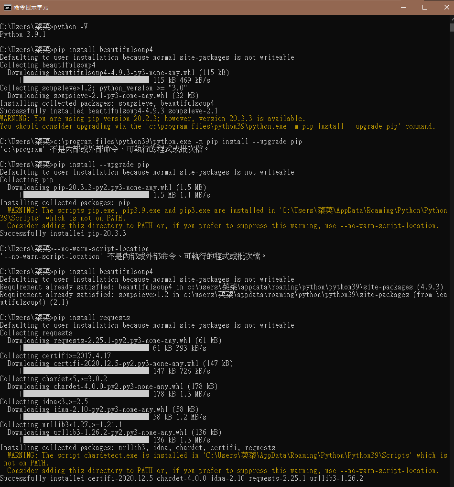
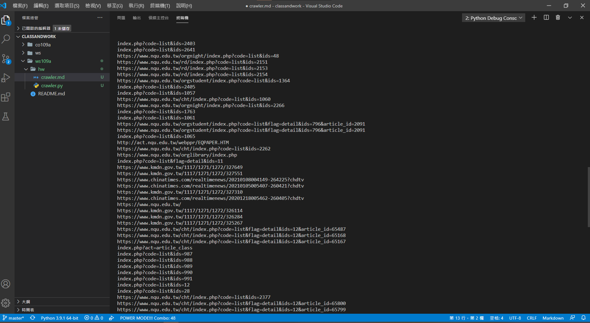

## 事前準備
使用```pip install beautifulsoup4```安裝beautifulsoup4套件,這個套件可以先讀取HTML的原始碼，再自動解析並產生一個```BeautifulSoup``` 物件，這個物件有整個HTML文件的結構樹，可以讓我們輕鬆找出需要的資料 。   。   
使用```pip install requests ```安裝requests套件，requests建立各種 HTTP 請求，從網頁伺服器上取得想要的資料。    



## code 
<pre>import requests
from bs4 import BeautifulSoup
response = requests.get("https://www.nqu.edu.tw/cht/index.php?") #把此頁面的HTML GET下來
soup = BeautifulSoup(response.text, "html.parser")#用Beautifulsoup4轉為HTML的parser
for k in soup.find_all('a'):
    print(k['href'])#查a標籤的href值
   </pre>

## 結果
    
這樣可以讓我可以清楚的知道這個網頁裡所有的url的。
 
